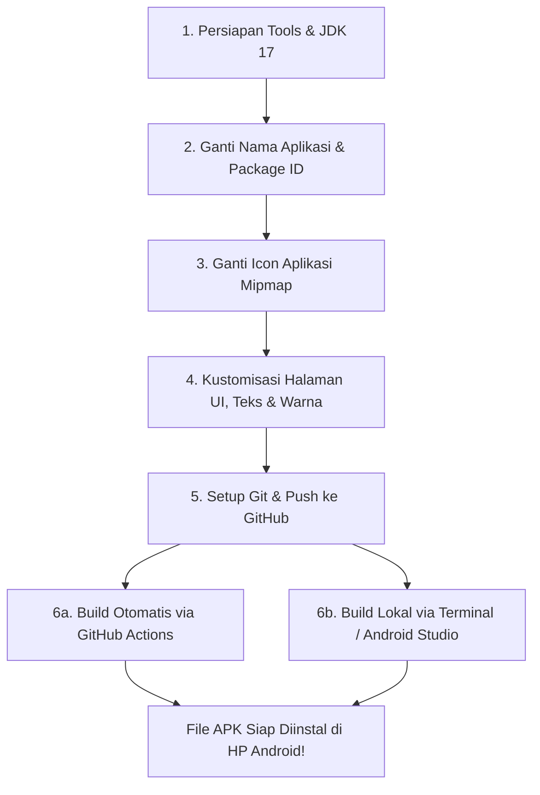

# 📘 Panduan Lengkap: Rebranding & Build APK dari Nol sampai Jadi

Panduan ini berisi tutorial langkah demi langkah untuk mengubah identitas aplikasi (**nama APK**, **icon launcher**, **halaman & tema UI**, **informasi pengembang**), mengunggahnya ke **GitHub**, hingga melakukan **build menjadi file APK** yang siap diinstal di HP Android.

> 📂 **Dokumentasi Lengkap Terpisah (Folder `panduan/`):**
> * 🛠️ [Modul 1: Tools & Persiapan Lingkungan](file:///d:/IceBeats/IceBeats/panduan/01_DAFTAR_TOOLS_DAN_PERSIAPAN.md)
> * 🗄️ [Modul 2: Setup Database & Storage Supabase](file:///d:/IceBeats/IceBeats/panduan/02_SETUP_DATABASE_SUPABASE.md)
> * 🔐 [Modul 3: Tutorial Login OAuth (Google, Facebook, GitHub, GitLab)](file:///d:/IceBeats/IceBeats/panduan/03_TUTORIAL_OAUTH_LOGIN.md)
> * 🎨 [Modul 4: Kustomisasi Nama, Icon & UI](file:///d:/IceBeats/IceBeats/panduan/04_REBRANDING_DAN_CUSTOM_UI.md)
> * 🚀 [Modul 5: Push ke GitHub & Build Menjadi APK](file:///d:/IceBeats/IceBeats/panduan/05_PUSH_GITHUB_DAN_BUILD_APK.md)

---

## 🗺️ Alur Pengerjaan (Workflow)



---

## 🛠️ Persyaratan Awal (Prerequisites)

Sebelum mulai, pastikan komputer/laptop Anda telah terpasang:
1. **JDK 17 (Java Development Kit 17)**: Proyek ini dikonfigurasi menggunakan toolchain Java 17.
   - Unduh dari [Azul Zulu JDK 17](https://www.azul.com/downloads/?version=java-17-lts) atau [Eclipse Temurin 17](https://adoptium.net/temurin/releases/?version=17).
   - Pastikan path `JAVA_HOME` sudah diarahkan ke folder JDK 17 tersebut.
2. **Android Studio** (Disarankan) atau **VS Code / Cline** dengan ekstensi Kotlin & Android.
3. **Git**: Terpasang untuk melakukan commit dan push ke repository GitHub.

---

## 1️⃣ Langkah 1: Mengubah Nama Aplikasi (App Name)

### A. Mengubah Nama Tampilan di Layar HP (Display Name)
Nama yang muncul di bawah icon aplikasi pada menu HP diatur di dalam file sumber daya string:

📂 **File:** `app/src/main/res/values/app_name.xml`

```xml
<?xml version="1.0" encoding="utf-8"?>
<resources>
    <!-- Ganti 'IceBeats' dengan nama aplikasi baru Anda -->
    <string name="app_name" translatable="false">NamaAplikasiAnda</string>
</resources>
```

> [!NOTE]
> Nama ini dipanggil langsung oleh `AndroidManifest.xml` pada atribut `android:label="@string/app_name"`.

---

### B. Mengubah Application ID (Package Name)
Application ID adalah identitas unik aplikasi di sistem Android. Mengubah ini memungkinkan aplikasi Anda diinstal **berdampingan** dengan aplikasi aslinya tanpa bentrok.

📂 **File:** `app/build.gradle.kts` (sekitar baris 35-40)

```kotlin
android {
    namespace = "com.valora.icebeats" // Biarkan atau sesuaikan jika perlu

    defaultConfig {
        // Ganti ID unik aplikasi Anda di sini (huruf kecil semua, dipisah titik):
        applicationId = "com.namabrand.musicapp"
        
        minSdk = 26
        targetSdk = 35
        versionCode = 176
        versionName = "7.0.7" // Anda bisa mengubah versi rilis di sini
        ...
    }
}
```

> [!TIP]
> Cukup ubah `applicationId`. Biarkan `namespace` tetap seperti aslinya jika Anda tidak ingin melakukan refactor import paket pada ratusan file Kotlin.

---

## 2️⃣ Langkah 2: Mengubah Icon Aplikasi (App Icon)

Icon aplikasi Android menggunakan sistem **Adaptive Icons** yang terbagi dalam berbagai folder resolusi (`mipmap-*`) di dalam `app/src/main/res/`.

| Folder | Resolusi Icon Standar | File yang Digunakan |
| :--- | :--- | :--- |
| `mipmap-mdpi/` | 48 x 48 px | `ic_launcher.png`, `ic_launcher_round.png`, `ic_launcher_foreground.png` |
| `mipmap-hdpi/` | 72 x 72 px | `ic_launcher.png`, `ic_launcher_round.png`, `ic_launcher_foreground.png` |
| `mipmap-xhdpi/` | 96 x 96 px | `ic_launcher.png`, `ic_launcher_round.png`, `ic_launcher_foreground.png` |
| `mipmap-xxhdpi/` | 144 x 144 px | `ic_launcher.png`, `ic_launcher_round.png`, `ic_launcher_foreground.png` |
| `mipmap-xxxhdpi/` | 192 x 192 px | `ic_launcher.png`, `ic_launcher_round.png`, `ic_launcher_foreground.png` |

### Cara 1: Menggunakan Android Studio Asset Studio (Paling Rapi & Otomatis)
1. Buka project di **Android Studio**.
2. Pada panel navigasi kiri, klik kanan pada folder **`app/src/main/res`** -> pilih **New** -> **Image Asset**.
3. Di bagian **Icon Type**, pilih **Launcher Icons (Adaptive and Legacy)**.
4. Di tab **Foreground Layer**, pilih **Asset type: Image**, lalu klik tombol browse file dan pilih logo baru Anda (disarankan gambar PNG transparan minimal 512x512 px).
5. Di tab **Background Layer**, pilih warna background yang serasi (misalnya warna solid atau gradien).
6. Klik **Next** lalu **Finish**. Android Studio otomatis membuat semua icon di seluruh folder `mipmap-*`.

### Cara 2: Menggunakan Script Otomatis `resize_icon.ps1` (Tanpa Android Studio)
Project ini sudah menyediakan script PowerShell untuk resize icon secara instan:

1. Siapkan file gambar logo baru Anda (misalnya simpan di `C:\logo_baru.png`).
2. Buka file `resize_icon.ps1` di root project.
3. Ubah variabel path gambar `$srcPath` dan folder tujuan `$resDir`:
   ```powershell
   $srcPath = "C:\path\ke\logo_baru.png"
   $resDir = ".\app\src\main\res"
   ```
4. Jalankan script melalui PowerShell:
   ```powershell
   powershell -ExecutionPolicy Bypass -File .\resize_icon.ps1
   ```

---

## 3️⃣ Langkah 3: Mengubah Tampilan & Halaman APK (UI, Theme & Pages)

Aplikasi ini dibangun menggunakan **Jetpack Compose**. Seluruh tampilan UI terletak di folder:
📂 `app/src/main/java/com/valora/icebeats/ui/`

```
app/src/main/java/com/valora/icebeats/ui/
├── screens/
│   ├── home/           <-- Halaman Beranda (rekomendasi musik, quick picks)
│   ├── player/         <-- Layar Pemutar Musik (mini player, fullscreen player)
│   │   └── themes/     <-- 15+ Pilihan Tema Pemutar Musik
│   ├── settings/       <-- Halaman Pengaturan & Tentang Aplikasi (About)
│   ├── search/         <-- Halaman Pencarian Lagu & Artis
│   ├── library/        <-- Halaman Koleksi, Playlist & Lagu Offline
│   └── lyrics/         <-- Layar Tampilan Lirik Berjalan
└── theme/
    ├── Color.kt        <-- Palet Warna Utama Aplikasi
    └── Theme.kt        <-- Konfigurasi Mode Gelap/Terang & Material You
```

### A. Mengubah Informasi Developer di Halaman About / Pengaturan
Untuk mengganti nama pembuat, link GitHub, link donasi, atau deskripsi aplikasi:

📂 **File:** `app/src/main/java/com/valora/icebeats/ui/screens/settings/AboutScreen.kt`
- Ubah link media sosial, nama pengembang, dan deskripsi aplikasi di bagian composable info.

### B. Mengubah Palet Warna (Theme & Colors)
Untuk mengubah warna aksen dan tema UI:

📂 **File:** `app/src/main/java/com/valora/icebeats/ui/theme/Color.kt`
```kotlin
// Anda dapat mengubah kode Hex warna sesuai branding baru Anda:
val PrimaryColor = Color(0xFF00E5FF)
val SecondaryColor = Color(0xFF7C4DFF)
val BackgroundDark = Color(0xFF0A0E17)
```

### C. Mengubah Teks & Label Aplikasi (Strings)
Untuk menerjemahkan atau mengubah teks menu, tombol, dan pesan notifikasi:

📂 **File:** `app/src/main/res/values/strings.xml`
- Buka file dan gunakan fitur pencarian (Ctrl+F) untuk menemukan teks yang ingin diganti (contoh: judul tab, pesan sambutan, teks dialog).

---

## 4️⃣ Langkah 4: Setup Git & Push ke GitHub

Pastikan cache build lokal tidak ikut terunggah dengan memastikan file `.gitignore` sudah aktif.

### Perintah Terminal / PowerShell:

```bash
# 1. Pastikan Anda berada di direktori root project
cd IceBeats

# 2. Hapus folder build lokal lama agar ringan
.\gradlew clean

# 3. Inisialisasi Git (jika belum ada)
git init

# 4. Tambahkan semua file perubahan
git add .

# 5. Buat commit pertama
git commit -m "feat: custom rebranding aplikasi dan icon baru"

# 6. Atur branch utama menjadi main
git branch -M main

# 7. Hubungkan repository lokal ke GitHub Anda:
# (Ganti URL di bawah dengan URL repository GitHub baru Anda)
git remote add origin https://github.com/USERNAME-ANDA/NAMA-REPO-ANDA.git

# 8. Unggah (push) ke GitHub
git push -u origin main
```

> [!TIP]
> Jika repository Anda sebelumnya sudah memiliki origin lain, jalankan `git remote remove origin` terlebih dahulu, lalu jalankan perintah nomor 7 di atas.

---

## 5️⃣ Langkah 5: Build Menjadi File APK

Tersedia **2 cara** untuk menghasilkan file APK:

### 🌟 Cara A: Build Otomatis via GitHub Actions (Sangat Direkomendasikan)
Project ini telah dilengkapi dengan workflow CI/CD otomatis di `.github/workflows/build-apk.yml`. 

1. Begitu Anda melakukan `git push` ke GitHub, GitHub Actions akan langsung:
   - Menyiapkan server build dengan Java 17.
   - Mengompilasi source code.
   - Menghasilkan file APK secara otomatis di cloud (tanpa menghabiskan RAM laptop Anda).
2. **Cara Mengunduh APK Hasil Build:**
   - Buka halaman repository Anda di GitHub.
   - Klik tab **Actions** di bagian atas.
   - Klik alur kerja (**workflow run**) terbaru yang sedang berjalan atau sudah selesai (bercentang hijau).
   - Di bagian paling bawah halaman tersebut pada seksi **Artifacts**, klik **App-Debug-APK** untuk mendownload file zip berisi APK yang siap diinstall di HP!

---

### 💻 Cara B: Build Lokal via Terminal / Command Prompt

Jika Anda ingin langsung mengompilasi APK di laptop Anda sendiri:

#### 1. Build Debug APK (Cepat & Langsung Siap Diuji di HP)
Buka PowerShell atau Terminal di folder project:
```powershell
.\gradlew assembleDebug
```
* **Lokasi file APK yang dihasilkan:**
  📁 `app/build/outputs/apk/debug/app-debug.apk`

#### 2. Build Release APK (Versi Optimal / Produksi)
```powershell
.\gradlew assembleRelease
```
* **Lokasi file APK yang dihasilkan:**
  📁 `app/build/outputs/apk/release/app-release-unsigned.apk` (atau `app-release.apk`)

---

## ⚠️ Troubleshooting Masalah Umum (FAQ)

> [!WARNING]
> **Error: "JAVA_HOME is not set and no java installation could be found"**
> - Pastikan Anda telah menginstal **JDK 17**.
> - Set environment variable di Windows:
>   ```powershell
>   $env:JAVA_HOME = "C:\Program Files\Eclipse Adoptium\jdk-17..."
>   ```

> [!WARNING]
> **Error: "SDK location not found"**
> - Buat file bernama `local.properties` di folder root project.
> - Isi dengan path direktori Android SDK di komputer Anda:
>   ```properties
>   sdk.dir=C\:\\Users\\NamaUserAnda\\AppData\\Local\\Android\\Sdk
>   ```

> [!TIP]
> **Error: "Gradle Out of Memory" saat kompilasi**
> - Buka file `gradle.properties`, lalu pastikan baris memori diatur secukupnya, contoh:
>   `org.gradle.jvmargs=-Xmx4096m -XX:MaxMetaspaceSize=1024m`

---

## 📄 Lisensi & Kredit

Project ini berbasis open-source di bawah lisensi GPL v3. Harap tetap menyertakan atribusi sumber asli saat memodifikasi dan membagikan kembali aplikasi ini.
