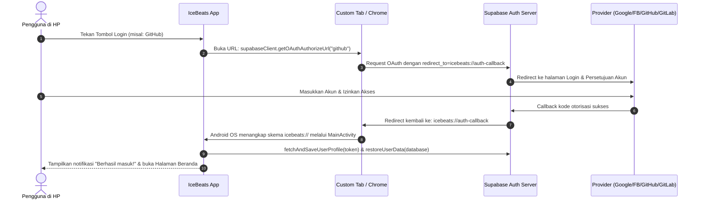

# 🔐 Bagian 3: Tutorial Lengkap Login OAuth (Google, Facebook, GitHub, GitLab)

Aplikasi **IceBeats** mendukung autentikasi modern multi-platform. Semua provider login sosial dihubungkan melalui **Supabase Authentication**, kemudian mengembalikan token otorisasi ke aplikasi Android melalui URL deep link:
`icebeats://auth-callback`

---

## 📌 Catatan Penting: Callback URL Supabase

Setiap provider login (Google, Facebook, GitHub, GitLab) memerlukan **Callback URL / Redirect URI**.
Format Callback URL resmi project Supabase Anda adalah:
```
https://<PROJECT-REF-ANDA>.supabase.co/auth/v1/callback
```
*(Contoh jika Project URL Anda adalah `https://xyzabc123.supabase.co`, maka Callback URL-nya adalah `https://xyzabc123.supabase.co/auth/v1/callback`)*.

---

## 1. 🌐 Setup Login Google (Google Sign-In)

### Langkah A: Konfigurasi di Google Cloud Console
1. Buka [Google Cloud Console](https://console.cloud.google.com/).
2. Buat Project baru atau pilih project yang sudah ada.
3. Buka menu **APIs & Services** -> **OAuth consent screen**:
   - Pilih User Type: **External** -> klik **Create**.
   - Isi **App name** (misal: `IceBeats`), User support email, dan Developer contact email.
   - Klik **Save and Continue** sampai selesai.
4. Buka menu **APIs & Services** -> **Credentials**:
   - Klik **+ CREATE CREDENTIALS** -> pilih **OAuth client ID**.
   - Pilih Application type: **Web application**.
   - Name: `Supabase Auth Google`.
   - Di bagian **Authorized redirect URIs**, klik **+ ADD URI** dan masukkan:
     ```
     https://<PROJECT-REF-ANDA>.supabase.co/auth/v1/callback
     ```
   - Klik **Create**.
   - Salin **Client ID** dan **Client Secret**.

### Langkah B: Masukkan ke Dashboard Supabase
1. Buka dashboard Supabase -> menu **Authentication** -> **Providers**.
2. Cari dan klik **Google**.
3. Aktifkan toggle **Enable Google provider**.
4. Tempelkan (Paste) **Client ID** dan **Client Secret** dari Google Cloud.
5. Klik **Save**.

---

## 2. 📘 Setup Login Facebook (Meta for Developers)

### Langkah A: Buat Aplikasi di Meta Developer
1. Buka [Meta for Developers](https://developers.facebook.com/) dan login dengan akun Facebook Anda.
2. Klik **My Apps** di kanan atas -> klik **Create App**.
3. Pilih Use Case: **Authenticate and request data from users with Facebook Login** -> klik **Next**.
4. Masukkan **App Name** (contoh: `IceBeats App`) dan email kontak Anda -> klik **Create app**.
5. Di menu sidebar dashboard Meta, buka **Use cases** -> klik **Customize** pada tombol Facebook Login -> pilih **Settings**.
6. Di bagian **Valid OAuth Redirect URIs**, masukkan:
   ```
   https://<PROJECT-REF-ANDA>.supabase.co/auth/v1/callback
   ```
7. Klik **Save changes** di bagian bawah.
8. Buka menu **App settings** -> **Basic** di sidebar kiri:
   - Salin **App ID**.
   - Klik tombol **Show** di samping **App secret**, masukkan password akun FB Anda, lalu salin **App secret**.

### Langkah B: Masukkan ke Dashboard Supabase
1. Di dashboard Supabase, buka menu **Authentication** -> **Providers**.
2. Cari dan klik **Facebook**.
3. Aktifkan toggle **Enable Facebook provider**.
4. Tempelkan **Client ID** (App ID Facebook) dan **Client Secret** (App Secret Facebook).
5. Klik **Save**.

---

## 3. 🐙 Setup Login GitHub (GitHub OAuth App)

### Langkah A: Buat OAuth App di GitHub
1. Buka akun GitHub Anda, lalu buka menu [GitHub Developer Settings](https://github.com/settings/developers).
2. Di menu kiri, klik **OAuth Apps** -> klik **New OAuth App** (atau *Register a new application*).
3. Isi data formulir:
   - **Application name**: `IceBeats Android`
   - **Homepage URL**: `https://github.com/B7ByteMe/IceBeats` (atau website Anda)
   - **Authorization callback URL**:
     ```
     https://<PROJECT-REF-ANDA>.supabase.co/auth/v1/callback
     ```
4. Klik **Register application**.
5. Di halaman aplikasi yang baru dibuat:
   - Salin **Client ID**.
   - Klik tombol **Generate a new client secret**, lalu segera salin **Client Secret** tersebut.

### Langkah B: Masukkan ke Dashboard Supabase
1. Di dashboard Supabase, buka menu **Authentication** -> **Providers**.
2. Cari dan klik **GitHub**.
3. Aktifkan toggle **Enable GitHub provider**.
4. Masukkan **Client ID** dan **Client Secret** yang Anda peroleh dari GitHub.
5. Klik **Save**.

---

## 4. 🦊 Setup Login GitLab (GitLab OAuth Application)

### Langkah A: Buat Aplikasi di GitLab
1. Buka [GitLab.com](https://gitlab.com/) dan login ke akun Anda.
2. Klik foto profil di pojok kiri atas/bawah -> pilih **Edit profile** (atau Preferences).
3. Di menu sidebar kiri, klik **Applications** (atau buka [gitlab.com/-/user_settings/applications](https://gitlab.com/-/user_settings/applications)).
4. Klik **Add new application**:
   - **Name**: `IceBeats App`
   - **Redirect URI**:
     ```
     https://<PROJECT-REF-ANDA>.supabase.co/auth/v1/callback
     ```
   - **Confidential**: Centang kotak ini.
   - **Scopes**: Centang opsi **`read_user`** dan **`openid`** (cukup dua ini agar bisa membaca nama dan email pengguna).
5. Klik **Save application**.
6. Salin **Application ID** (Client ID) dan **Secret** (Client Secret).

### Langkah B: Masukkan ke Dashboard Supabase
1. Di dashboard Supabase, buka menu **Authentication** -> **Providers**.
2. Cari dan klik **GitLab**.
3. Aktifkan toggle **Enable GitLab provider**.
4. Masukkan **Client ID** (Application ID) dan **Client Secret**.
5. Klik **Save**.

---

## 5. 🔄 Cara Kerja Alur Login di Aplikasi Android



---

> ➡️ **Lanjut ke Bagian 4:** [Panduan Kustomisasi Nama, Icon & Halaman UI](file:///d:/IceBeats/IceBeats/panduan/04_REBRANDING_DAN_CUSTOM_UI.md)
